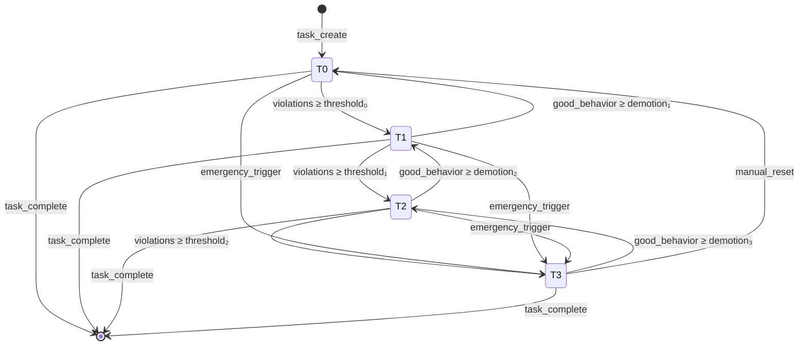

/**
 *     ______   __  __     __         ______     ______
 *    /\  == \ /\ \/\ \   /\ \       /\  ___\   /\  ___\
 *    \ \  _-/ \ \ \_\ \  \ \ \____  \ \___  \  \ \  __\
 *     \ \_\    \ \_____\  \ \_____\  \/\_____\  \ \_____\
 *      \/_/     \/_____/   \/_____/   \/_____/   \/_____/
 *
 * Author: Colin MacRitchie / Ripple Group
 */

# Tier Transition State Machine Formal Specification

## Executive Summary

This document formally specifies the tier transition state machine for Tokio-Pulse's TierManager, defining states, transitions, guards, and actions with mathematical precision.

## State Space Definition

### Primary States

```
S = {T₀, T₁, T₂, T₃, C}

Where:
- T₀: Monitor (Tier 0) - Observation only
- T₁: Warn (Tier 1) - Soft intervention
- T₂: Yield (Tier 2) - Active intervention
- T₃: Isolate (Tier 3) - OS-level isolation
- C: Completed - Task finished/dropped
```

### Extended State Variables

```
σ = ⟨tier, violations, last_transition, cooldown_end, burst_active⟩

Where:
- tier ∈ {0, 1, 2, 3}
- violations ∈ ℕ - Consecutive violation count
- last_transition ∈ ℕ - Timestamp of last tier change (ns)
- cooldown_end ∈ ℕ - End of cooldown period (ns)
- burst_active ∈ {true, false} - Burst budget active
```

## Transition Events

```
E = {poll_start, poll_end, budget_exhausted, cpu_exceeded,
     yield_requested, task_complete, cooldown_expired,
     emergency_trigger, manual_reset}
```

### Event Definitions

| Event | Description | Trigger Condition |
|-------|-------------|-------------------|
| `poll_start` | Task begins poll operation | `Future::poll()` called |
| `poll_end` | Task completes poll | `Poll::Ready` or `Poll::Pending` |
| `budget_exhausted` | Poll budget depleted | `remaining_budget ≤ 0` |
| `cpu_exceeded` | CPU time limit exceeded | `cpu_time > cpu_ms_budget` |
| `yield_requested` | Voluntary yield | `tokio::task::yield_now()` |
| `task_complete` | Task finished | `Poll::Ready` with completion |
| `cooldown_expired` | Cooldown period ended | `now > cooldown_end` |
| `emergency_trigger` | System overload detected | `system_load > threshold` |
| `manual_reset` | Admin intervention | External API call |

## State Transition Function

```
δ: S × E × σ → S × σ × A

Where A is the set of actions to perform
```

### Formal Transition Rules

#### Tier Promotion (Upward)

```
δ(Tᵢ, budget_exhausted, σ) = {
    (Tᵢ₊₁, σ', {increment_counter, apply_intervention})
        if i < 3 ∧ violations ≥ threshold[i] ∧ now > cooldown_end
    (Tᵢ, σ', {increment_violation})
        otherwise
}

Where:
σ' = ⟨i+1, 0, now, now + cooldown[i], false⟩ (promoted)
σ' = ⟨i, violations + 1, last_transition, cooldown_end, burst_active⟩ (not promoted)
```

#### Tier Demotion (Downward)

```
δ(Tᵢ, poll_end, σ) = {
    (Tᵢ₋₁, σ', {decrement_counter, remove_intervention})
        if i > 0 ∧ good_behavior_count ≥ demotion_threshold ∧ now > cooldown_end
    (Tᵢ, σ', {increment_good_behavior})
        otherwise
}

Where:
σ' = ⟨i-1, 0, now, now + cooldown[i-1], false⟩ (demoted)
```

#### Emergency Escalation

```
δ(Tᵢ, emergency_trigger, σ) = {
    (T₃, σ', {isolate_immediately, alert_admin})
        if system_critical = true
    (Tᵢ₊₁, σ', {apply_intervention})
        if i < 3
    (Tᵢ, σ, ∅)
        otherwise
}
```

## Guard Conditions

### Promotion Guards

```rust
fn can_promote(state: &TaskState) -> bool {
    let tier = state.tier;
    let violations = state.violations;
    let now = Instant::now();

    // Check all conditions
    tier < 3 &&
    violations >= PROMOTION_THRESHOLDS[tier] &&
    now > state.cooldown_end &&
    !state.burst_active &&
    !is_system_task(state.task_id)
}
```

### Demotion Guards

```rust
fn can_demote(state: &TaskState) -> bool {
    let tier = state.tier;
    let good_polls = state.consecutive_good_polls;
    let now = Instant::now();

    tier > 0 &&
    good_polls >= DEMOTION_THRESHOLDS[tier] &&
    now > state.cooldown_end &&
    !has_recent_violations(state)
}
```

### Hysteresis Prevention

```rust
fn apply_hysteresis(state: &mut TaskState, new_tier: u8) {
    let tier_delta = (new_tier as i8 - state.tier as i8).abs();

    // Longer cooldown for larger jumps
    let cooldown_ms = match tier_delta {
        1 => 100,   // Adjacent tier: 100ms
        2 => 500,   // Skip one tier: 500ms
        3 => 1000,  // Skip two tiers: 1s
        _ => 100,
    };

    state.cooldown_end = Instant::now() + Duration::from_millis(cooldown_ms);
}
```

## Action Specifications

### Intervention Actions

```rust
enum InterventionAction {
    Monitor,           // T₀: Collect metrics only
    Warn,             // T₁: Log warning, notify hooks
    Yield,            // T₂: Force yield, reduce budget
    Isolate,          // T₃: OS-level isolation
}

fn apply_intervention(tier: u8, task_id: TaskId) -> Result<()> {
    match tier {
        0 => {
            // Monitor: No active intervention
            metrics::increment_counter("tier_0_tasks");
        }
        1 => {
            // Warn: Soft intervention
            log::warn!("Task {} promoted to Tier 1", task_id);
            reduce_budget(task_id, 0.75);  // 75% budget
        }
        2 => {
            // Yield: Active intervention
            log::warn!("Task {} promoted to Tier 2", task_id);
            reduce_budget(task_id, 0.50);  // 50% budget
            force_yield(task_id);
        }
        3 => {
            // Isolate: OS-level intervention
            log::error!("Task {} promoted to Tier 3", task_id);
            reduce_budget(task_id, 0.25);  // 25% budget
            apply_os_isolation(task_id)?;
        }
        _ => unreachable!()
    }
    Ok(())
}
```

### Budget Adjustments

```rust
fn adjust_budget_for_tier(budget: &mut TaskBudget, tier: u8) {
    let base_budget = budget.initial_budget;

    let adjusted = match tier {
        0 => base_budget,               // 100%
        1 => base_budget * 3 / 4,       // 75%
        2 => base_budget / 2,           // 50%
        3 => base_budget / 4,           // 25%
        _ => base_budget / 4,
    };

    budget.remaining.store(adjusted, Ordering::Relaxed);
}
```

## Transition Diagram



## Configuration Parameters

### Threshold Configuration

```rust
pub struct TierThresholds {
    // Promotion thresholds (violations needed)
    pub promotion: [u32; 4],

    // Demotion thresholds (good polls needed)
    pub demotion: [u32; 4],

    // Cooldown periods (ms)
    pub cooldown: [u64; 4],

    // Burst allowance per tier
    pub burst_factor: [f32; 4],
}

impl Default for TierThresholds {
    fn default() -> Self {
        TierThresholds {
            promotion: [3, 3, 3, u32::MAX],  // Can't promote from T3
            demotion: [0, 10, 20, 30],       // Harder to demote from higher tiers
            cooldown: [100, 200, 500, 1000], // Longer cooldowns for higher tiers
            burst_factor: [2.0, 1.5, 1.2, 1.0], // Less burst at higher tiers
        }
    }
}
```

## Invariants

### Safety Invariants

```
I₁: ∀t ∈ Tasks: 0 ≤ t.tier ≤ 3
    (All tasks have valid tier)

I₂: ∀t ∈ Tasks: t.tier = 3 ⟹ isolation_active(t)
    (Tier 3 tasks are always isolated)

I₃: ∀t ∈ Tasks: t.cooldown_end > now ⟹ no_tier_change(t)
    (No tier changes during cooldown)

I₄: ∀t ∈ Tasks: t.violations = 0 ⟺ tier_changed_recently(t)
    (Violations reset on tier change)
```

### Liveness Properties

```
L₁: ◇(violations ≥ threshold) ⟹ ◇(tier_promoted)
    (Eventually promoted if violations persist)

L₂: ◇(good_behavior ≥ threshold) ⟹ ◇(tier_demoted)
    (Eventually demoted if behavior improves)

L₃: □(task_complete) ⟹ ◇(state = Completed)
    (Completed tasks eventually reach terminal state)
```

## Burst Handling

### Burst Budget Calculation

```rust
fn calculate_burst_budget(base_budget: u32, tier: u8) -> u32 {
    let burst_factor = BURST_FACTORS[tier as usize];
    (base_budget as f32 * burst_factor) as u32
}

fn should_activate_burst(state: &TaskState) -> bool {
    let throttle_rate = state.throttled_periods as f64 /
                       state.total_periods as f64;

    throttle_rate > 0.1 &&  // >10% throttling
    !state.burst_active &&
    state.tier < 3  // No burst for isolated tasks
}

fn apply_burst(state: &mut TaskState, budget: &mut TaskBudget) {
    state.burst_active = true;
    let burst_budget = calculate_burst_budget(budget.initial, state.tier);
    budget.remaining.store(burst_budget, Ordering::Relaxed);

    // Schedule burst deactivation
    state.burst_end = Instant::now() + Duration::from_millis(200);
}
```

## Monitoring and Metrics

### State Transition Metrics

```rust
pub struct TransitionMetrics {
    // Counters per transition type
    pub promotions: [Counter; 3],     // T0→T1, T1→T2, T2→T3
    pub demotions: [Counter; 3],      // T3→T2, T2→T1, T1→T0
    pub emergency_escalations: Counter,
    pub manual_resets: Counter,

    // Time spent in each tier
    pub tier_duration: [Histogram; 4],

    // Transition frequency
    pub transitions_per_second: Gauge,

    // Hysteresis effectiveness
    pub rapid_transitions: Counter,  // Transitions within cooldown
}
```

### Observability

```rust
impl TierManager {
    fn record_transition(&self, from: u8, to: u8, reason: TransitionReason) {
        // Update metrics
        match reason {
            TransitionReason::Promotion => {
                self.metrics.promotions[from as usize].increment();
            }
            TransitionReason::Demotion => {
                self.metrics.demotions[to as usize].increment();
            }
            TransitionReason::Emergency => {
                self.metrics.emergency_escalations.increment();
            }
            TransitionReason::Manual => {
                self.metrics.manual_resets.increment();
            }
        }

        // Log for debugging
        trace!(
            "Task tier transition: {} -> {} (reason: {:?})",
            from, to, reason
        );

        // Check for rapid transitions (hysteresis failure)
        if self.is_rapid_transition(from, to) {
            self.metrics.rapid_transitions.increment();
            warn!("Rapid tier transition detected: possible thrashing");
        }
    }
}
```

## Testing Strategy

### Property-Based Tests

```rust
#[cfg(test)]
mod tests {
    use proptest::prelude::*;

    proptest! {
        #[test]
        fn tier_bounds_maintained(
            initial_tier in 0u8..=3,
            events in prop::collection::vec(any::<Event>(), 0..100)
        ) {
            let mut state = TaskState::new(initial_tier);
            for event in events {
                state.process_event(event);
                assert!(state.tier <= 3);
            }
        }

        #[test]
        fn cooldown_prevents_transitions(
            tier in 0u8..=3,
            cooldown_ms in 100u64..=1000
        ) {
            let mut state = TaskState::new(tier);
            state.enter_cooldown(cooldown_ms);

            // Try to transition during cooldown
            let result = state.try_transition();
            assert_eq!(result, Err(TransitionError::CooldownActive));
        }
    }
}
```

### State Machine Verification

```rust
#[test]
fn verify_all_transitions() {
    let transitions = [
        (T0, BudgetExhausted, T1),
        (T1, BudgetExhausted, T2),
        (T2, BudgetExhausted, T3),
        (T3, GoodBehavior, T2),
        (T2, GoodBehavior, T1),
        (T1, GoodBehavior, T0),
        (T0, Emergency, T3),
        (T3, ManualReset, T0),
    ];

    for (from, event, expected_to) in transitions {
        let mut state = TaskState::new(from);
        state.process_event(event);
        assert_eq!(state.tier, expected_to);
    }
}
```

## Conclusion

This formal specification defines a robust tier transition state machine that:

1. **Prevents thrashing**: Through cooldown periods and hysteresis
2. **Allows recovery**: Via demotion for improved behavior
3. **Handles emergencies**: With direct escalation to Tier 3
4. **Supports bursting**: Temporary budget increases for spiky workloads
5. **Maintains invariants**: Ensuring system consistency
6. **Provides observability**: Comprehensive metrics and logging

The state machine balances responsiveness to misbehaving tasks with stability, avoiding rapid oscillations while ensuring system resources are protected.